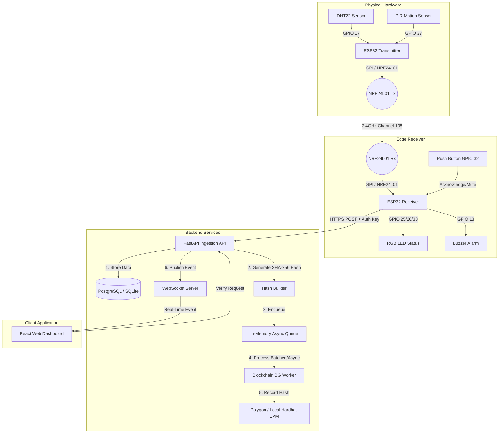

# Implementation Plan: Blockchain-Enabled Secure IoT Monitoring System

This document outlines the proposed design, architecture, and implementation steps for building the **Blockchain-Enabled Secure IoT Environmental and Motion Monitoring System**. 

The system implements a secure data ingestion pipeline from DHT22 and PIR sensors connected to an ESP32 transmitter, through an NRF24L01 wireless link to an ESP32 receiver, over Wi-Fi to a FastAPI backend, saving to a database, anchoring hashes to a Polygon smart contract, and updating a React dashboard in real-time.

---

## Architecture & Data Flow



---

## User Review Required

> [!IMPORTANT]
> - **Blockchain RPC & Dev Environment**: To facilitate immediate developer testing without requiring a real Polygon wallet with gas fees, we will support a **mock blockchain fallback** and **local Hardhat node integration** out of the box. You can configure this via the `.env` file.
> - **Database Choice**: We will build the application using SQLAlchemy so it supports both **PostgreSQL** (production) and **SQLite** (local developer quickstart with `sqlite:///./sensor_data.db`).
> - **Hardware Demonstration**: If physical hardware is not yet wired up, the backend will feature a **Simulated Hardware Client** (runnable via a simple CLI script) that mimics the ESP32 receiver's HTTPS ingestion and packet sequencing, clearly marked as **DEMO MODE** in the UI.

---

## Open Questions

1. **How should we handle gas fees/funding on Polygon for the worker?**
   - *Recommendation*: The backend worker will use a single private key configured via `BLOCKCHAIN_PRIVATE_KEY` as the authorized recorder. For production, this wallet must be pre-funded with MATIC (POL). For local development, we will provide a Hardhat network setup where accounts are pre-funded with 1000 test ETH.
2. **What should be the batching / throttling behavior for the Blockchain worker?**
   - *Recommendation*: Sensor data is stored immediately in the DB and sent to the UI via WebSockets. To avoid EVM rate limits and high gas costs, the background worker will process database records sequentially in the background using an asynchronous task queue. If a transaction fails, it remains `PENDING` in the database and is retried.

---

## Proposed Changes

### Project Directory Structure
```
d:/NRF24L01/
├── backend/                  # FastAPI Backend
│   ├── app/
│   │   ├── __init__.py
│   │   ├── config.py
│   │   ├── database.py
│   │   ├── models.py
│   │   ├── schemas.py
│   │   ├── security.py
│   │   ├── blockchain.py     # Web3.py integration and background worker
│   │   ├── main.py           # FastAPI Application & WebSocket endpoints
│   ├── tests/
│   │   ├── __init__.py
│   │   ├── test_api.py
│   ├── requirements.txt
├── frontend/                 # React Web Dashboard (Vite + TS + Tailwind)
│   ├── src/
│   │   ├── components/       # UI Cards (Temp, Humidity, Motion, Blockchain)
│   │   ├── hooks/            # WebSockets client hook
│   │   ├── App.tsx
│   │   ├── index.css
│   │   ├── main.tsx
│   ├── package.json
│   ├── tsconfig.json
│   ├── vite.config.ts
├── blockchain/               # Solidity Smart Contracts (Hardhat)
│   ├── contracts/
│   │   └── SensorDataRegistry.sol
│   ├── scripts/
│   │   └── deploy.ts
│   ├── test/
│   │   └── SensorDataRegistry.test.ts
│   ├── hardhat.config.ts
│   ├── package.json
├── database/                 # SQL schemas and migration setup
│   └── schema.sql
├── esp32/                    # ESP32 Arduino Firmware
│   ├── transmitter/
│   │   └── transmitter.ino
│   ├── receiver/
│   │   └── receiver.ino
├── docs/                     # Documentation files
│   ├── API.md
│   ├── BLOCKCHAIN.md
│   └── ESP32_SETUP.md
├── .env.example              # Shared environment template
└── README.md
```

---

### Database Schema (SQLAlchemy Models)

#### Table: `devices`
- `id` (VARCHAR, Primary Key) - unique identifier (e.g. `receiver-01`)
- `name` (VARCHAR) - display name
- `api_key_hash` (VARCHAR) - SHA-256 hashed API key for authentication
- `created_at` (TIMESTAMP)

#### Table: `device_status`
- `device_id` (VARCHAR, Primary Key, FK to `devices.id`)
- `status` (VARCHAR) - `ONLINE` or `OFFLINE`
- `last_seen` (TIMESTAMP)
- `last_packet_number` (INTEGER)
- `last_temperature` (FLOAT)
- `last_humidity` (FLOAT)
- `last_motion` (BOOLEAN)
- `updated_at` (TIMESTAMP)

#### Table: `sensor_readings`
- `id` (INTEGER, Primary Key, Autoincrement)
- `device_id` (VARCHAR, FK to `devices.id`, Indexed)
- `temperature` (FLOAT)
- `humidity` (FLOAT)
- `motion` (BOOLEAN)
- `packet_number` (INTEGER, Indexed)
- `received_at` (TIMESTAMP, Indexed)
- `created_at` (TIMESTAMP)
- *Constraint*: Unique index on `(device_id, packet_number)` to prevent duplicate ingestions.

#### Table: `motion_events`
- `id` (INTEGER, Primary Key, Autoincrement)
- `device_id` (VARCHAR, FK to `devices.id`)
- `event_type` (VARCHAR) - always `'MOTION'`
- `detected_at` (TIMESTAMP) - start time (PIR transitions LOW -> HIGH)
- `cleared_at` (TIMESTAMP, Nullable) - end time (PIR transitions HIGH -> LOW)
- `created_at` (TIMESTAMP)

#### Table: `blockchain_records`
- `id` (INTEGER, Primary Key, Autoincrement)
- `sensor_record_id` (INTEGER, FK to `sensor_readings.id`, Unique)
- `device_id` (VARCHAR)
- `data_hash` (VARCHAR) - SHA-256 hash of the deterministic sensor record
- `transaction_hash` (VARCHAR, Nullable)
- `block_number` (INTEGER, Nullable)
- `network` (VARCHAR) - e.g., `polygon` or `hardhat`
- `contract_address` (VARCHAR)
- `recorded_at` (TIMESTAMP, Nullable)
- `verification_status` (VARCHAR) - `PENDING`, `VERIFIED`, or `FAILED`
- `created_at` (TIMESTAMP)

---

### Smart Contract: `SensorDataRegistry.sol`
Implemented in Solidity 0.8.20. It stores:
1. Device authorization mappings (controlled by contract owner).
2. Cryptographic record hashes associated with `(deviceId, packetNumber)`.

```solidity
// SPDX-License-Identifier: MIT
pragma solidity ^0.8.20;

contract SensorDataRegistry {
    address public owner;

    struct Device {
        address authority;
        bool isRegistered;
        uint256 registeredAt;
    }

    struct SensorRecord {
        bytes32 dataHash;
        uint256 timestamp;
        address recorder;
    }

    mapping(string => Device) private devices;
    mapping(string => mapping(uint256 => SensorRecord)) private sensorRecords;

    event DeviceRegistered(string indexed deviceId, address indexed authority);
    event SensorHashRecorded(string indexed deviceId, uint256 indexed packetNumber, bytes32 dataHash, uint256 timestamp);

    modifier onlyOwner() {
        require(msg.sender == owner, "Caller is not the owner");
        _;
    }

    modifier onlyAuthorized(string memory deviceId) {
        require(devices[deviceId].isRegistered, "Device is not registered");
        require(devices[deviceId].authority == msg.sender || msg.sender == owner, "Not authorized to record data");
        _;
    }

    constructor() {
        owner = msg.sender;
    }

    function registerDevice(string memory deviceId, address authority) external onlyOwner {
        devices[deviceId] = Device({
            authority: authority,
            isRegistered: true,
            registeredAt: block.timestamp
        });
        emit DeviceRegistered(deviceId, authority);
    }

    function recordSensorHash(string memory deviceId, uint256 packetNumber, bytes32 dataHash) external onlyAuthorized(deviceId) {
        require(dataHash != bytes32(0), "Hash cannot be zero");
        require(sensorRecords[deviceId][packetNumber].dataHash == bytes32(0), "Record already exists");

        sensorRecords[deviceId][packetNumber] = SensorRecord({
            dataHash: dataHash,
            timestamp: block.timestamp,
            recorder: msg.sender
        });

        emit SensorHashRecorded(deviceId, packetNumber, dataHash, block.timestamp);
    }

    function verifySensorHash(string memory deviceId, uint256 packetNumber, bytes32 dataHash) external view returns (bool) {
        return sensorRecords[deviceId][packetNumber].dataHash == dataHash;
    }

    function getSensorHash(string memory deviceId, uint256 packetNumber) external view returns (bytes32) {
        return sensorRecords[deviceId][packetNumber].dataHash;
    }

    function getDevice(string memory deviceId) external view returns (address authority, bool isRegistered) {
        return (devices[deviceId].authority, devices[deviceId].isRegistered);
    }
}
```

---

### Backend Ingestion & Hash Generation
Deterministic string representation for hashing:
```python
# Format: device_id:temperature:humidity:motion:packet_number:received_at
# Floats are formatted to exactly 1 decimal place to prevent floating-point mismatch
hash_payload = f"{device_id}:{temperature:.1f}:{humidity:.1f}:{str(motion).lower()}:{packet_number}:{received_at_iso}"
data_hash = hashlib.sha256(hash_payload.encode('utf-8')).hexdigest()
```

---

### Verification Flow

When user clicks `VERIFY DATA` in the web dashboard for a specific sensor reading:
1. Frontend makes request: `GET /api/v1/blockchain/verify/{record_id}`
2. Backend retrieves the database record.
3. Backend reconstructs the deterministic payload string and hashes it.
4. Backend fetches the hash on-chain by calling the contract function `getSensorHash(device_id, packet_number)`.
5. Comparison:
   - If contract hash is `0x0000...`, status is `NOT REGISTERED` or `PENDING` (if transaction is in queue).
   - If contract hash matches recalculated hash, status is `VERIFIED`.
   - If they differ, status is `INTEGRITY FAILURE` (indicating DB tamper event).

---

## Verification Plan

### Automated Tests
1. **Unit and Integration Tests (`backend/tests/`)**:
   - `pytest` suite for validation checks (Pydantic range validation).
   - Authenticated sensor data ingestion (valid vs invalid API key).
   - Duplicate packet rejection test.
   - Motion event state machine (correct creation of new event, matching closed event).
   - Offline check (re-marking to OFFLINE after 10s inactivity).
   - Blockchain verification states: `VERIFIED`, `PENDING`, `NOT REGISTERED`, `INTEGRITY FAILURE` (simulated by tampering database record).
2. **Smart Contract Tests (`blockchain/test/`)**:
   - Hardhat tests verifying contract deployment, device registration, hash storage, and verification.

### Manual Verification
1. **Hardware Simulation**: Run a mock ESP32 hardware script that streams data to the FastAPI endpoint to verify the full real-time pipeline.
2. **Database Tampering Demonstration**: Modify a record in the database manually via SQLite/PostgreSQL, trigger the `VERIFY` button, and witness the system instantly flag an `INTEGRITY FAILURE`.
3. **Network Failure Resilience**: Stop the Hardhat node, send packets, verify they are successfully ingested and marked `PENDING`, restart Hardhat node, and check that they are automatically flushed and registered on-chain.
